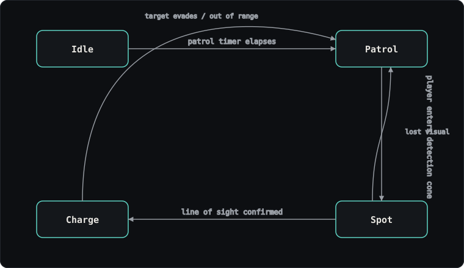

# STRETCH — Enemy AI, Save System & Debug Tooling

Technical write-up for my contribution to **STRETCH**, a 2D platformer built by a team of 8 on a
fully custom C++ engine (no Unity, no Unreal — engine and tooling written by the team).

**This is a documentation-only repo.** STRETCH was a school project at Singapore Institute of
Technology / DigiPen Singapore, and I don't have clearance to publish the original coursework
source. What's here is my own write-up of the systems I built, with a reconstructed excerpt
standing in for the real implementation until that's cleared. If you're reading this as part of a
hiring process and want to see real code, ask — I have a clean-room demo of the same AI system in
progress (linked below once it's up).

▶ [Portfolio case study for this project](https://HenreyHu.github.io/projects/stretch.html) — same content, video-first.

---

## My role

**Programmer — AI & UI Champion.** Team of 8, custom C++ engine. I owned:

- Enemy AI (finite state machine + directional detection)
- Save / load serialization, checkpoints
- Animation state handling
- In-engine ImGui debug tooling used by the rest of the team

Art, audio and level design were built by teammates.

## Enemy AI — finite state machine with directional detection



Four states — `Idle`, `Patrol`, `Spot`, `Charge`. Detection isn't a raw distance check: it compares
the player's position against the enemy's facing direction and a field-of-view angle, so an enemy
can be walked past from behind without noticing. Losing sight during `Spot` or `Charge` drops back
to `Patrol` rather than `Idle`, so the enemy keeps searching near the player's last known position
instead of forgetting instantly.

**Why an FSM and not a behaviour tree or full pathfinding-driven agent:** the scope was a handful
of clearly distinct behaviours with simple transition conditions. A state machine kept it easy for
the rest of the team to reason about and extend mid-production, which mattered more here than
generality.

```cpp
// Representative excerpt of the FSM update step — recreated for this writeup,
// pending confirmation from the program office on sharing the original source.
void EnemyController::UpdateState(float dt) {
    switch (currentState) {
        case State::Idle:
            if (idleTimer.Elapsed() > idleDuration) {
                TransitionTo(State::Patrol);
            }
            break;

        case State::Patrol:
            FollowPatrolPath(dt);
            if (CanSeePlayer()) {
                TransitionTo(State::Spot);
            }
            break;

        case State::Spot:
            FaceTarget(lastKnownPlayerPos, dt);
            if (!CanSeePlayer()) {
                TransitionTo(State::Patrol);
            } else if (spotTimer.Elapsed() > confirmDelay) {
                TransitionTo(State::Charge);
            }
            break;

        case State::Charge:
            MoveToward(player->GetPosition(), chargeSpeed, dt);
            if (!CanSeePlayer() || DistanceTo(player) > giveUpRadius) {
                TransitionTo(State::Patrol);
            }
            break;
    }
}

bool EnemyController::CanSeePlayer() const {
    glm::vec2 toPlayer = glm::normalize(player->GetPosition() - position);
    float facingDot = glm::dot(facingDirection, toPlayer);
    return facingDot > cosf(glm::radians(fovHalfAngle))
        && DistanceTo(player) < detectionRange
        && HasLineOfSight(player->GetPosition());
}
```

> Excerpt above is a reconstruction for illustration, not a copy of the submitted source.

## Save / load and checkpoints

Progress serializes to disk on checkpoint trigger and on manual save, and restores fully on load —
player position, enemy states, collected items and level flags all round-trip through the same
path. Checkpoints write asynchronously so hitting one mid-play doesn't cause a frame hitch.

The harder design question wasn't writing the data — it was deciding what counted as game state
versus what could be recomputed on load. Keeping that boundary explicit kept save files small and
made adding a new saveable system later a one-line registration rather than a rewrite.

## Debug tooling

Built an ImGui-based debug overlay the rest of the team used directly: live state inspection for
the enemy FSM (current state, timers, detection cone), a save-file inspector, and toggles for
common test scenarios. Putting this in the team's hands, not just mine, cut down on "why is the
enemy stuck" pings during production.

## What I'd change

The transition conditions are hard-coded per state, which was fine at four states but would get
unwieldy past six or seven — a small data-driven transition table would make future tuning easier
without recompiling. I'd also want to profile the line-of-sight check under load; it wasn't a
bottleneck with a handful of enemies on screen, but I never confirmed where it would start to be
one.

---

**Stack:** C++, custom engine, ImGui
**Team:** 8
**Timeframe:** Year 2
